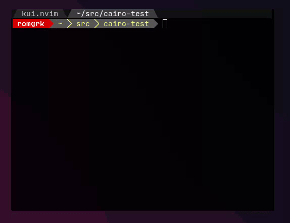

# kui.nvim

This project is a neovim UI framework, aiming to use the Kitty graphics protocol to build complex graphical interfaces.
This depends on the user having a terminal with support for the [kitty graphics protocol](https://sw.kovidgoyal.net/kitty/graphics-protocol/)
as well as [libcairo](https://www.cairographics.org/) installed.

See [kirby.nvim](https://github.com/romgrk/kirby.nvim) for a more complex example.

See https://github.com/romgrk/kui-demo.nvim for a template showing how to implement the demo above.

## Plugins

These plugins are based on kui:
 - [kirby.nvim](https://github.com/romgrk/kirby.nvim)

## Status & features

Status: experimental, good enough for small use cases

Features:
 - [x] Container system (transpiled from Pixi.JS via TypescriptToLua)
 - [ ] Images (I don't remember if I implemented it, TBC)
 - [ ] Masks
 - [x] Graphics (lines, rects, ovals, paths)
 - [x] Basic text (size, family, weight, color)
 - [ ] Advanced text (highlighted text (think code syntax), proper layout & rendering)
 - [x] Medium-performance rendering (think 30FPS animations, medium surface)
 - [ ] High-performance rendering (think 60FPS animations, large surface)

## License

MIT

### Includes code from:

 - [pixi.js](https://github.com/pixijs/pixijs): MIT
 - [colord](https://github.com/omgovich/colord): MIT
 - [hologram.nvim](https://github.com/edluffy/hologram.nvim): MIT
 - [tstoluaplugin.nvim](https://github.com/equals03/tstoluaplugin.nvim): MIT

